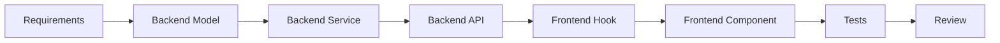

# NovaSight Multi-Agent Framework Instructions

## Overview

This document provides instructions for using the NovaSight multi-agent framework to implement the self-service BI platform. The framework consists of specialized agents, skills, and prompts designed to work together in VS Code.

---

## 🏛️ Framework Architecture

```
.github/
├── agents/                    # Specialized implementation agents
│   ├── novasight-orchestrator.agent.md    # Master orchestrator
│   ├── infrastructure-agent.agent.md       # DevOps/Infrastructure
│   ├── backend-agent.agent.md              # Flask API
│   ├── frontend-agent.agent.md             # React UI
│   ├── template-engine-agent.agent.md      # Jinja2 code generation
│   ├── orchestration-agent.agent.md        # Airflow DAGs
│   ├── ai-agent.agent.md                   # Ollama/LLM integration
│   ├── data-sources-agent.agent.md         # Database connections
│   ├── dbt-agent.agent.md                  # Semantic layer
│   ├── testing-agent.agent.md              # Quality assurance
│   ├── security-agent.agent.md             # Security hardening
│   ├── admin-agent.agent.md                # Tenant management
│   └── dashboard-agent.agent.md            # Analytics/Dashboards
├── skills/                    # Reusable implementation patterns
│   ├── flask-api/SKILL.md                  # REST API patterns
│   ├── react-components/SKILL.md           # React component patterns
│   ├── template-engine/SKILL.md            # Template generation
│   └── multi-tenant-db/SKILL.md            # Database isolation
├── prompts/
│   └── PROMPTS.md             # Implementation prompt templates
└── instructions/
    └── INSTRUCTIONS.md        # This file
```

---

## 🚀 Getting Started

### Step 1: Project Setup

1. **Initialize the workspace:**
   ```
   @orchestrator Initialize the NovaSight project following Phase 1 of the implementation plan.
   ```

2. **Set up infrastructure:**
   ```
   @infrastructure Set up Docker Compose development environment with all required services.
   ```

3. **Create backend structure:**
   ```
   @backend Create the Flask application structure with app factory pattern.
   ```

4. **Create frontend structure:**
   ```
   @frontend Initialize the React/Vite project with Shadcn/UI.
   ```

### Step 2: Implement Core Components

Follow the implementation plan phases:

| Phase | Duration | Components |
|-------|----------|------------|
| Phase 1 | Weeks 1-4 | Infrastructure, Backend Core, Frontend Core |
| Phase 2 | Weeks 5-8 | Data Source Management, Ingestion Engine |
| Phase 3 | Weeks 9-12 | dbt Semantic Layer, DAG Orchestration |
| Phase 4 | Weeks 13-16 | Template Engine, AI Service |
| Phase 5 | Weeks 17-20 | Analytics Platform, Dashboards |
| Phase 6 | Weeks 21-24 | Admin, Security, Testing |

---

## 📋 Agent Usage Guide

### Orchestrator Agent
**Purpose:** Coordinates the overall implementation, manages phases, and delegates to specialized agents.

**When to use:**
- Starting a new implementation phase
- Coordinating cross-component work
- Getting implementation status
- Resolving inter-component dependencies

**Example:**
```
@orchestrator What is the current implementation status and what should we work on next?
```

### Infrastructure Agent
**Purpose:** Handles Docker, databases, networking, and deployment.

**When to use:**
- Setting up development environment
- Configuring databases (PostgreSQL, ClickHouse)
- Setting up Airflow, Redis, Ollama
- Creating deployment configurations

**Example:**
```
@infrastructure Configure ClickHouse for multi-tenant database isolation.
```

### Backend Agent
**Purpose:** Implements Flask REST APIs, services, and database models.

**When to use:**
- Creating API endpoints
- Implementing business logic services
- Creating database models
- Setting up authentication/authorization

**Example:**
```
@backend Create the ConnectionService with CRUD operations and encryption.
```

### Frontend Agent
**Purpose:** Builds React components, pages, and state management.

**When to use:**
- Creating UI components
- Building pages and layouts
- Implementing forms with validation
- Setting up API integration

**Example:**
```
@frontend Build the ConnectionForm component with validation and test button.
```

### Template Engine Agent
**Purpose:** Generates code artifacts from validated templates.

**When to use:**
- Creating PySpark job templates
- Generating Airflow DAG code
- Building dbt model files
- Any code generation task

**⚠️ CRITICAL:** Always follow the Template Engine Rule - no arbitrary code generation!

**Example:**
```
@template-engine Generate a PySpark full-load job for the orders table.
```

### AI Agent
**Purpose:** Integrates Ollama for natural language to SQL conversion.

**When to use:**
- Implementing the query assistant
- Building prompt templates
- Adding schema context to AI
- SQL validation and RLS injection

**Example:**
```
@ai Implement the SQL generation service with validation.
```

### Security Agent
**Purpose:** Reviews and hardens security implementations.

**When to use:**
- Security code review
- Implementing authentication
- Adding input validation
- Audit logging setup

**Example:**
```
@security Review the authentication flow for security issues.
```

### Testing Agent
**Purpose:** Creates and maintains test suites.

**When to use:**
- Writing unit tests
- Creating integration tests
- Setting up E2E tests
- Achieving coverage targets

**Example:**
```
@testing Write unit tests for the ConnectionService with 80% coverage.
```

---

## 🔧 Skills Usage Guide

### Flask API Skill
**Location:** `.github/skills/flask-api/SKILL.md`

Use this skill when implementing:
- Blueprint structure
- Endpoint patterns
- Request validation
- Response formatting
- Error handling

### React Components Skill
**Location:** `.github/skills/react-components/SKILL.md`

Use this skill when implementing:
- Component structure
- Form patterns
- Data tables
- Query hooks
- Page layouts

### Template Engine Skill
**Location:** `.github/skills/template-engine/SKILL.md`

Use this skill when implementing:
- Template registry
- Validation schemas
- Sandboxed rendering
- Artifact generation

### Multi-Tenant DB Skill
**Location:** `.github/skills/multi-tenant-db/SKILL.md`

Use this skill when implementing:
- Schema isolation
- Tenant context
- RLS filters
- Cross-tenant security

---

## 📝 Prompt Templates

The prompts collection (`.github/prompts/PROMPTS.md`) provides templates for common implementation tasks. Use these as starting points:

### Using a Prompt

1. Find the appropriate prompt category
2. Copy the prompt template
3. Replace `[PLACEHOLDERS]` with actual values
4. Reference the appropriate agent
5. Execute and iterate

### Example Workflow

```
1. Use "Create REST API Endpoint" prompt for /api/v1/connections
2. Use "Implement Service Layer" prompt for ConnectionService
3. Use "Create Form Component" prompt for ConnectionForm
4. Use "Write Unit Tests" prompt for ConnectionService tests
```

---

## 🔒 Critical Rules

### Template Engine Rule (ADR-002)
**NO ARBITRARY CODE GENERATION.** All executable artifacts must be:
1. Generated from pre-approved Jinja2 templates
2. Validated through Pydantic schemas
3. Scanned for forbidden patterns
4. Stored with integrity checksums

### Multi-Tenancy Rules
1. Always verify tenant context before database operations
2. Use schema-per-tenant (PostgreSQL) and database-per-tenant (ClickHouse)
3. Never expose tenant IDs in URLs
4. Audit all cross-tenant access attempts

### Security Rules
1. All inputs must be validated with Pydantic
2. Use parameterized queries only
3. Implement rate limiting on all endpoints
4. Log all security events to audit log
5. Apply security headers to all responses

---

## 📊 Implementation Tracking

### Phase Checklist Template

```markdown
## Phase [N]: [Name]
Duration: Week X - Week Y

### Components
- [ ] Component A
  - [ ] Task A.1
  - [ ] Task A.2
- [ ] Component B
  - [ ] Task B.1

### Acceptance Criteria
- [ ] All tests passing
- [ ] Coverage targets met
- [ ] Security review completed
- [ ] Documentation updated
```

### Progress Reporting

Use the orchestrator to get status updates:
```
@orchestrator Generate implementation progress report for Phase 2.
```

---

## 🔄 Workflow Patterns

### Feature Implementation Workflow



### Cross-Agent Collaboration

When a task spans multiple agents:

1. **Orchestrator** breaks down the task
2. **Backend** implements API layer
3. **Frontend** implements UI layer
4. **Testing** writes tests
5. **Security** reviews implementation

---

## 📚 Reference Documents

### Business Requirements
- [BRD Part 1](../docs/requirements/BRD.md) - Epics 1-2
- [BRD Part 2](../docs/requirements/BRD_Part2.md) - Epics 3-4
- [BRD Part 3](../docs/requirements/BRD_Part3.md) - Epics 5-6
- [BRD Part 4](../docs/requirements/BRD_Part4.md) - Epic 7 + NFRs

### Architecture
- [Architecture Decisions](../docs/requirements/Architecture_Decisions.md)

### Implementation
- [Implementation Plan](../docs/implementation/IMPLEMENTATION_PLAN.md)

---

## ❓ Troubleshooting

### Common Issues

**Issue:** Agent not responding correctly
**Solution:** Ensure you're referencing the correct agent file and providing sufficient context.

**Issue:** Template validation failing
**Solution:** Check Pydantic schema requirements and ensure all required fields are provided.

**Issue:** Multi-tenant isolation not working
**Solution:** Verify tenant context is set in g.tenant before database operations.

**Issue:** Tests failing in CI
**Solution:** Ensure test fixtures properly set up tenant and user contexts.

### Getting Help

1. Check the relevant agent file for patterns
2. Reference the skill files for implementation details
3. Consult the Architecture Decisions for design rationale
4. Review the BRD for acceptance criteria

---

*NovaSight Multi-Agent Framework v1.0*
*Last Updated: Phase 0 - Framework Setup*
