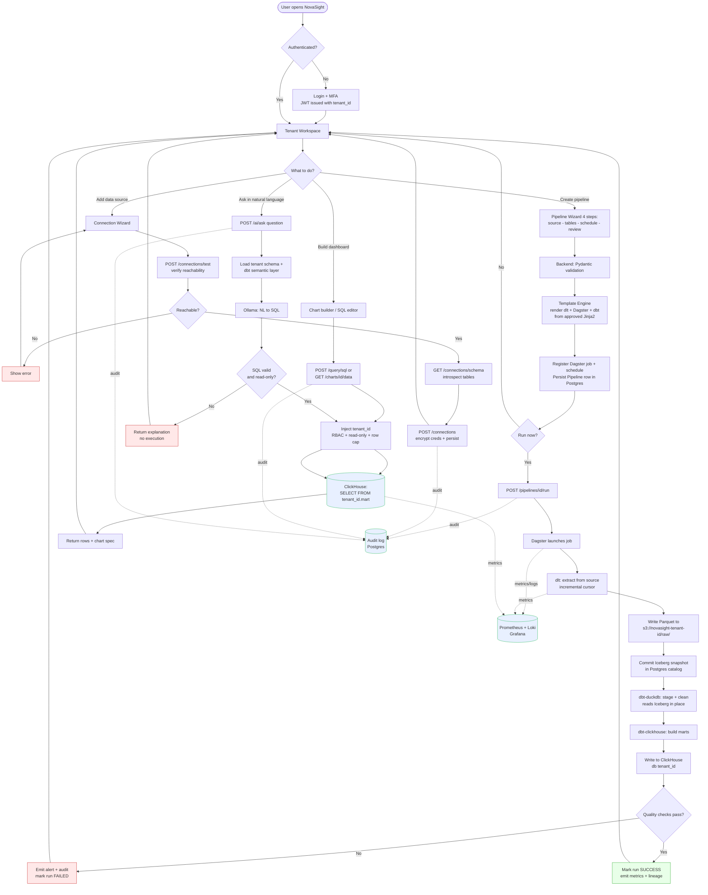

# NovaSight Platform — End-to-End Flowchart

> Source-of-truth diagram for the NovaSight platform flow.
> Keep this file in sync with any architectural change. Edit the Mermaid block below.

## Flow

## Notes

- **Tenant isolation**: `tenant_id` is taken from the JWT and enforced at every store boundary
  (Postgres RLS, S3 bucket-per-tenant, Iceberg namespace `tenant_{id}`, ClickHouse DB `tenant_{id}`).
- **Template Engine Rule**: pipeline artifacts (dlt, Dagster, dbt) are only generated from
  pre-approved Jinja2 templates with Pydantic-validated inputs. No arbitrary code paths.
- **Read-only guard**: SQL editor and AI NL2SQL outputs are parsed (sqlglot), forced to
  `SELECT`, capped in rows, and pinned to the tenant's ClickHouse database.

## Maintenance

When the architecture changes, update the Mermaid block above in the same PR.
Companion documents:

- [Blueprint overview](./PLATFORM_BLUEPRINT.md) *(create if/when needed)*
- [Architecture decisions](../requirements/Architecture_Decisions.md)
- [Spark → dlt migration](../../.github/instructions/MIGRATION_SPARK_TO_DLT.md)
