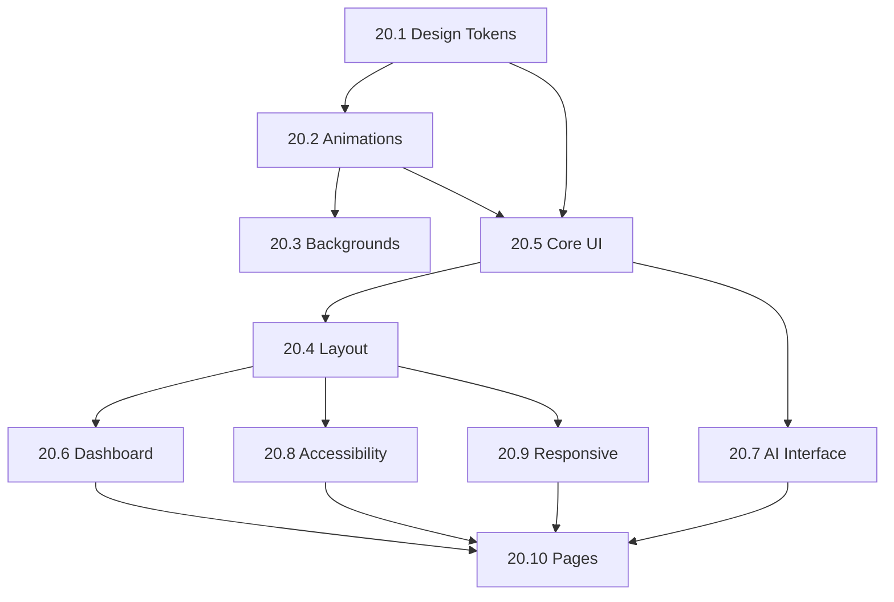

# Implementation 020 - UI Redesign & Polish

## Overview

This document describes the comprehensive UI redesign for NovaSight, implementing a modern AI/Technology-inspired design system with glass morphism, micro-interactions, and accessibility-first approach.

**Phase:** 6 - Polish & Launch  
**Duration:** Week 22-23  
**Owner Agent:** `@frontend`  
**Design Reference:** [Aivent Theme](https://madebydesignesia.com/themes/aivent/index-static-background.html)

---

## Objectives

1. Establish a cohesive dark-first design system with design tokens
2. Implement glass morphism and modern visual effects
3. Add micro-interactions and animations for enhanced UX
4. Ensure WCAG 2.1 AA accessibility compliance
5. Create responsive layouts for all screen sizes
6. Polish AI-specific UI components

---

## Component Breakdown

### Task 20.1: Design Token System

**Priority:** P0  
**Effort:** 2 days

| Deliverable | Path |
|-------------|------|
| Design tokens CSS | `frontend/src/styles/design-tokens.css` |
| Tailwind extension | `frontend/tailwind.config.ts` |

**Design Tokens:**

```yaml
colors:
  background:
    primary: "#0a0a0f"
    secondary: "#12121a"
    tertiary: "#1a1a25"
  accent:
    indigo: "#6366f1"
    purple: "#8b5cf6"
    violet: "#a855f7"
  neon:
    cyan: "#22d3ee"
    pink: "#ec4899"
    green: "#10b981"
  glass: "rgba(255, 255, 255, 0.03)"

typography:
  font-ui: "Inter"
  font-code: "JetBrains Mono"

transitions:
  micro: "150ms"
  base: "250ms"
  slow: "350ms"
  spring: "500ms"
```

---

### Task 20.2: Animation System

**Priority:** P0  
**Effort:** 2 days

| Deliverable | Path |
|-------------|------|
| Keyframe animations | `frontend/src/styles/animations.css` |
| Framer Motion variants | `frontend/src/lib/motion-variants.ts` |

**Required Animations:**

| Animation | Type | Usage |
|-----------|------|-------|
| `ai-pulse` | Keyframe | Glowing effect for AI elements |
| `gradient-flow` | Keyframe | Moving gradient backgrounds |
| `float` | Keyframe | Decorative floating motion |
| `neural-pulse` | Keyframe | SVG stroke animation |
| `fade-up` | Framer Motion | Page/section entrance |
| `scale-in` | Framer Motion | Modal/dialog entrance |
| `stagger-children` | Framer Motion | List item animations |

---

### Task 20.3: Background Components

**Priority:** P1  
**Effort:** 2 days

| Component | Path |
|-----------|------|
| GridBackground | `frontend/src/components/backgrounds/GridBackground.tsx` |
| NeuralNetwork | `frontend/src/components/backgrounds/NeuralNetwork.tsx` |
| ParticleField | `frontend/src/components/backgrounds/ParticleField.tsx` |

**Requirements:**
- SVG pattern grids with subtle opacity
- Radial gradient overlays
- Animated floating orbs with blur
- Canvas-based particle system with mouse interaction
- Performance-optimized with `pointer-events: none`

---

### Task 20.4: Layout Components

**Priority:** P0  
**Effort:** 3 days

| Component | Path |
|-----------|------|
| Sidebar | `frontend/src/components/layout/Sidebar.tsx` |
| Header | `frontend/src/components/layout/Header.tsx` |
| CommandPalette | `frontend/src/components/layout/CommandPalette.tsx` |
| MobileNav | `frontend/src/components/layout/MobileNav.tsx` |
| DashboardLayout | `frontend/src/components/layout/DashboardLayout.tsx` |

**Sidebar Requirements:**
- Framer Motion animated width (72px collapsed, 280px expanded)
- Glass morphism background with border
- Active state with animated indicator (layoutId)
- Nested navigation support
- User profile section

**Header Requirements:**
- Glass morphism with backdrop blur
- Breadcrumb navigation
- Global search trigger (Cmd+K)
- Notifications, theme toggle, user menu
- Mobile menu trigger

**Command Palette:**
- `cmdk` library with Radix Dialog
- Cmd+K / Ctrl+K keyboard shortcut
- Command groups (Quick Actions, Navigation, Recent)
- Fuzzy search filtering
- Keyboard navigation

---

### Task 20.5: Core UI Components

**Priority:** P0  
**Effort:** 3 days

| Component | Path |
|-----------|------|
| GlassCard | `frontend/src/components/ui/glass-card.tsx` |
| Button variants | `frontend/src/components/ui/button.tsx` |
| Input styling | `frontend/src/components/ui/input.tsx` |
| SearchInput | `frontend/src/components/ui/search-input.tsx` |
| EmptyState | `frontend/src/components/ui/empty-state.tsx` |
| Skeleton loaders | `frontend/src/components/skeletons/` |

**GlassCard Variants:**
- `default`: Standard glass effect
- `elevated`: Stronger shadow, lift on hover
- `interactive`: Scale and glow on hover
- `ai`: Animated gradient border

**Button Variants:**
- `primary`: Gradient (indigo→purple), glow shadow
- `secondary`: Tertiary background, border hover
- `ghost`: Transparent, hover background
- `outline`: Accent border, fill on hover
- `ai`: Animated gradient (purple→pink)
- `destructive`: Red gradient

---

### Task 20.6: Dashboard Components

**Priority:** P0  
**Effort:** 3 days

| Component | Path |
|-----------|------|
| MetricCard | `frontend/src/components/dashboard/MetricCard.tsx` |
| DashboardGrid | `frontend/src/components/dashboard/DashboardGrid.tsx` |
| DashboardWidget | `frontend/src/components/dashboard/DashboardWidget.tsx` |
| ChartTheme | `frontend/src/lib/chart-theme.ts` |

**MetricCard Requirements:**
- Glass card base with hover effects
- Large gradient text value
- Trend indicator (up/down with color)
- Optional sparkline chart
- Counter animation on mount

**Chart Theme:**
- Accent color palette array
- Glass tooltip styling
- Subtle grid lines
- Muted axis text
- Responsive breakpoints

---

### Task 20.7: AI Interface Components

**Priority:** P0  
**Effort:** 3 days

| Component | Path |
|-----------|------|
| AIChatPanel | `frontend/src/components/ai/AIChatPanel.tsx` |
| AIThinkingIndicator | `frontend/src/components/ai/AIThinkingIndicator.tsx` |
| AIButton | `frontend/src/components/ui/ai-button.tsx` |
| QueryAssistant | `frontend/src/components/analytics/QueryAssistant.tsx` |

**AIChatPanel Requirements:**
- Message list with user/AI distinction
- AI typing indicator (animated dots)
- Syntax-highlighted code blocks
- Copy button for code/SQL
- Streaming response support
- Suggested prompts/quick actions

**Visual Distinction:**
- User messages: right-aligned, accent background
- AI messages: left-aligned, glass background, AI avatar

**AIButton:**
- Animated rotating gradient border
- Sparkle icon animation
- Pulsing glow effect
- Loading state with thinking animation

---

### Task 20.8: Accessibility Implementation

**Priority:** P0  
**Effort:** 2 days

| Deliverable | Path |
|-------------|------|
| Focus styles | `frontend/src/styles/focus.css` |
| Skip link | Integrated into layouts |
| ARIA enhancements | Component updates |

**Requirements:**
- Visible focus rings (2px solid accent, 2px offset)
- Skip to content link
- Focus trap for modals/dialogs
- Roving tabindex for menus
- Arrow key navigation for lists
- Escape key to close overlays
- Proper heading hierarchy (h1-h6)
- ARIA landmarks (main, nav, aside)
- ARIA live regions for dynamic content
- Descriptive alt text
- Form labels and error announcements

---

### Task 20.9: Responsive Design

**Priority:** P0  
**Effort:** 2 days

| Deliverable | Path |
|-------------|------|
| useMediaQuery hook | `frontend/src/hooks/useMediaQuery.ts` |
| useBreakpoint hook | `frontend/src/hooks/useBreakpoint.ts` |
| ResponsiveTable | `frontend/src/components/ui/responsive-table.tsx` |
| Show component | `frontend/src/components/ui/show.tsx` |

**Breakpoints:**
- `sm`: 640px
- `md`: 768px
- `lg`: 1024px
- `xl`: 1280px
- `2xl`: 1536px

**Mobile Considerations:**
- Touch-friendly tap targets (44px minimum)
- Mobile-first CSS approach
- Bottom navigation bar on mobile
- Card stack layout for tables on mobile
- Swipe gestures for drawers

---

### Task 20.10: Page Templates

**Priority:** P1  
**Effort:** 3 days

| Page | Path |
|------|------|
| Landing | `frontend/src/pages/Landing.tsx` |
| Dashboard Home | `frontend/src/pages/Dashboard/Home.tsx` |
| Login | `frontend/src/pages/Auth/Login.tsx` |

**Landing Page Sections:**
1. Hero with animated headline
2. Grid background with floating orbs
3. Feature cards grid (stagger animation)
4. Stats/metrics section
5. How it works steps
6. CTA section with gradient button
7. Footer

**Dashboard Home Sections:**
1. Welcome header with user name
2. Quick stats row (MetricCards)
3. Recent activity feed
4. Quick actions grid
5. Favorite dashboards
6. AI insights card
7. Getting started checklist (new users)

---

## Implementation Order



---

## Acceptance Criteria

### Visual Design
- [ ] Dark mode as default with functional light mode toggle
- [ ] Glass morphism effects render correctly across browsers
- [ ] Animations run at 60fps without jank
- [ ] Grid and neural backgrounds display correctly
- [ ] All accent colors applied consistently

### Accessibility
- [ ] WCAG 2.1 AA compliance verified
- [ ] Keyboard navigation works for all interactive elements
- [ ] Screen reader announcements for dynamic content
- [ ] Focus indicators visible on all focusable elements
- [ ] Color contrast ratios meet minimum requirements

### Responsiveness
- [ ] All pages functional on mobile (320px+)
- [ ] Sidebar collapses appropriately on tablet/mobile
- [ ] Touch targets meet 44px minimum
- [ ] No horizontal scroll on any viewport

### Performance
- [ ] Lighthouse performance score > 90
- [ ] First Contentful Paint < 1.5s
- [ ] Animations use CSS transforms/opacity (GPU accelerated)
- [ ] No layout shifts from loading content

---

## Dependencies

| Dependency | Version | Purpose |
|------------|---------|---------|
| `framer-motion` | ^10.x | Animation library |
| `cmdk` | ^0.2.x | Command palette |
| `@radix-ui/react-dialog` | ^1.x | Modal primitives |
| `react-grid-layout` | ^1.4.x | Dashboard grid |
| `recharts` | ^2.x | Chart library |

---

## Testing Requirements

| Test Type | Coverage Target |
|-----------|-----------------|
| Component unit tests | 80% |
| Visual regression tests | Key components |
| Accessibility audit | axe-core integration |
| Responsive tests | Playwright viewports |

---

## Files to Create/Modify

### New Files
```
frontend/src/styles/
├── design-tokens.css
├── animations.css
└── focus.css

frontend/src/lib/
├── motion-variants.ts
└── chart-theme.ts

frontend/src/components/backgrounds/
├── GridBackground.tsx
├── NeuralNetwork.tsx
└── ParticleField.tsx

frontend/src/components/layout/
├── Sidebar.tsx
├── Header.tsx
├── CommandPalette.tsx
├── MobileNav.tsx
└── DashboardLayout.tsx

frontend/src/components/ui/
├── glass-card.tsx
├── search-input.tsx
├── empty-state.tsx
├── responsive-table.tsx
├── ai-button.tsx
├── show.tsx
└── theme-toggle.tsx

frontend/src/components/dashboard/
├── MetricCard.tsx
├── DashboardGrid.tsx
└── DashboardWidget.tsx

frontend/src/components/ai/
├── AIChatPanel.tsx
├── AIThinkingIndicator.tsx
└── QueryAssistant.tsx

frontend/src/components/skeletons/
├── CardSkeleton.tsx
├── TableSkeleton.tsx
├── ChartSkeleton.tsx
└── FormSkeleton.tsx

frontend/src/hooks/
├── useMediaQuery.ts
└── useBreakpoint.ts

frontend/src/pages/
├── Landing.tsx
└── Dashboard/Home.tsx
```

### Modified Files
```
frontend/tailwind.config.ts        # Extend with design tokens
frontend/src/components/ui/button.tsx   # Add new variants
frontend/src/components/ui/input.tsx    # Enhanced styling
frontend/src/components/ui/card.tsx     # Add glass variant
frontend/src/index.css              # Import new styles
```

---

## Rollback Plan

If UI redesign causes issues:
1. Feature flag `ENABLE_NEW_UI` to toggle between old/new
2. Keep original component files with `.legacy.tsx` suffix
3. CSS variables allow easy theme switching
4. Gradual rollout by page/feature

---

## Related Documents

- [BRD Part 3](../requirements/BRD_Part3.md) - Epic 5: Analytics Engine (Dashboard UI)
- [BRD Part 4](../requirements/BRD_Part4.md) - NFR-002: Accessibility Requirements
- [Architecture Decisions](../requirements/Architecture_Decisions.md) - ADR-009: Frontend Architecture

---

*Implementation 020 - UI Redesign & Polish v1.0*
